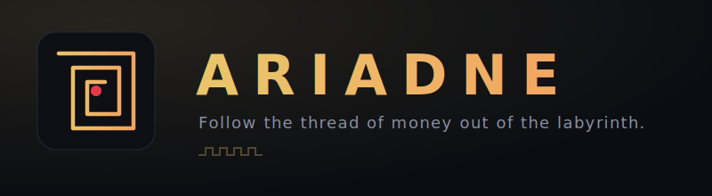

<p align="center">
  
</p>

<p align="center">
  
  <a href="LICENSE"></a>
  
  
</p>

> **A blockchain money-flow tracer for lawful financial-crime investigation.**
> Give Ariadne an address tied to crime; it follows the money hop by hop, grades how
> confident it is that each stop is illicit, names the ones it can — and, crucially,
> **measures and reports its own accuracy.**

In the myth, Ariadne gave the thread that traced the path out of the Minotaur's labyrinth.
This tool follows the thread of money out of the blockchain maze.

---

## Why this one is different

Most forensic demos claim they work. Ariadne ships a harness that scores itself against
known-answer cases and prints exactly where it fails:

| Category | Score | Meaning |
|---|---|---|
| **Detection** | **4 / 4** | grades known ransomware / sanctioned / scam wallets correctly, and does **not** flag a clean wallet |
| **Attribution** | **1 / 2** | follows the money to the cash-out, but cannot yet *name* every exchange |

```bash
ariadne validate      # known-answer scorecard
ariadne measure       # confusion matrix: precision / recall / FP / FN
```

`measure` puts numbers on the trade-off: a **0% false-positive rate** — it never falsely accuses a
legitimate address — with recall bounded by attribution data. A tool honest about its own blind
spots, in both directions, is the entire point.

## What it does

- **Trace** value flow **forward** (where did it go?) or **backward** (source of funds) across
  Bitcoin, Ethereum, USDT/USDC, and USDT-on-Tron — with **concurrent, rate-limit-aware fetching**.
- **Grade findings by confidence** of an illicit link (Confirmed → High → Medium → Low → Info),
  deliberately conservatively — an exchange that received dirty funds is a *cash-out lead to
  subpoena*, **never** branded an offender.
- **Selectable, documented taint models** — **poison** (maximal exposure), **haircut**
  (proportional dilution, the default), and **FIFO** (first-in-first-out / *Clayton's Case*, the
  rule courts actually use). Every result records *which model* produced it, so a finding is an
  auditable claim (`--taint-model fifo`), not a black-box score.
- **Signed evidence bundles** — every report can be sealed into an **Ed25519-signed** bundle with a
  per-investigation **chain of custody** (each conclusion tied to the exact API response it used,
  by URL + timestamp + SHA-256) and a **reproducibility manifest**. `ariadne verify-evidence`
  checks the signature and custody root with no key and no network.
- **Name the cash-out** — **exchange deposit-address discovery** attributes an unlabelled endpoint
  to the exchange it sweeps into (many funders → one hot wallet), and a **versioned attribution
  store** (provenance, confidence, supersession history) lets that coverage *compound* across
  investigations.
- **Graph link-analysis** over everything seen — shortest path between two entities, betweenness
  **centrality** (find the broker/hub), and **community detection** (find the ring).
- **Cross-chain / bridge correlation** — match a bridge deposit on one chain to the withdrawal on
  another by amount + time, to follow money through a chain hop (`ariadne correlate`).
- **Money-laundering typology + risk engine** — classifies the trace against recognised typologies
  (ransomware cash-out, sanctions exposure, mixing/peel layering, cross-chain layering) and folds
  them into a single, *explainable* composite risk grade.
- **Sanctions / illicit-exposure screening** (`ariadne screen`) — a compliance-grade verdict
  (sanctioned entity / direct / indirect / high-risk / clear) with hop-distance and exposed value.
- **Temporal / behavioural fingerprinting** (`ariadne timeline`) — infers likely operator timezone
  from activity hours, plus movement velocity, burstiness and dormancy — labelled as the
  probabilistic lead it is, never a locate.
- **Entity clustering** by *two* pillars — common-input-ownership **and** change-address
  identification — with exchange / CoinJoin guardrails.
- **Court-ready expert report** — every `--report` also emits a standardized Markdown expert
  statement (methodology → findings → risk → chain of custody → **limitations** → next steps).
- **Counter-laundering** — CoinJoin detection (Whirlpool / Wasabi), mixer / DEX / bridge
  break-points, and peel-chain + off-ramp detection.
- **Live monitoring** of new blocks and the mempool, with a transparent, explainable suspicion
  scorer that flags and auto-investigates — every point carries a human-readable reason.
- **24/7 daemon** (`--daemon`) — run continuously, alerting the operator via console, a persistent
  alert log, and an optional webhook (Slack / Discord / SIEM), with de-duplication and state that
  survives restarts.
- **Batch operations** (`ariadne operation`) — feed a list of suspect wallets; it investigates each,
  writes a per-wallet report, and connects them into a *ring* by the cash-out infrastructure they share.
- **~20,000 attribution labels** pulled from public feeds (OFAC sanctions, ransomware,
  scam / phishing, named exchanges, and **stablecoin-issuer freezes**) via `ariadne update-intel`.
- **Opsec by design** — route all provider queries through a **SOCKS/Tor proxy**, or point each
  chain at your **own self-hosted indexer**, so you never leak your investigative targets to a
  third-party explorer. Chains without real data are **gated off by default** (no hollow surface).
- **Persistent, tamper-evident knowledge base** — Ariadne remembers every investigation
  (hash-chained for evidence integrity) and recognises addresses it has seen before.
- **Two accuracy harnesses** — `ariadne validate` (known-answer real cases) and `ariadne
  adversarial` (a **deterministic, per-technique** detection scorecard: 100% detection, 0% false
  alarm on the constructed suite — fully reproducible offline).
- **Reports** — a plain-English narrative plus JSON, Graphviz DOT, and an interactive HTML graph.
- **A themed web console** with **real token-bound RBAC** (roles resolved server-side, not from a
  spoofable header) and audit logging; and a full CLI.

## Install

```bash
git clone https://github.com/darkhellenter-ops/ariadne.git && cd ariadne
python -m venv .venv
. .venv/bin/activate          # Windows: .venv\Scripts\activate
pip install -e .              # installs the `ariadne` command
ariadne update-intel          # pull ~20k attribution labels (recommended)
```

## Usage

```bash
# Launch the web console  ->  http://127.0.0.1:8000
ariadne serve

# Trace a Bitcoin address (with taint, findings, signed evidence bundle, and reports)
ariadne trace 12t9YDPgwueZ9NyMgw519p7AA8isjr6SMw --chain btc --depth 4 --report

# Pick a documented taint model and name the cash-outs it reaches
ariadne trace <address> --taint-model fifo --discover-deposits --report

# Verify a sealed evidence bundle (signature + chain of custody), offline
ariadne verify-evidence reports/<basename>.evidence.json

# Trace USDT-on-Tron — where investment-scam money actually moves
ariadne trace <T...address> --chain trx --depth 3

# Backward: where did the money come from?
ariadne trace <address> --direction backward

# Find every wallet controlled by the same actor
ariadne cluster <address>

# Batch-investigate a list of wallets and connect them into a ring ("operation")
ariadne operation --name theseus --wallets suspects.txt

# Live-monitor new blocks or the mempool; auto-investigate the suspicious
ariadne monitor --chain btc --auto-trace
ariadne monitor --chain btc --mempool --auto-trace

# Run 24/7: watch continuously and alert the operator (console + log + webhook)
ariadne monitor --chain btc --daemon --auto-trace --webhook https://hooks.slack.com/...

# Compliance-grade sanctions / illicit-exposure screening
ariadne screen <address> --chain usdt

# Temporal / behavioural profile — active hours, likely timezone, velocity
ariadne timeline <address> --chain btc

# Name an unlabelled cash-out via exchange deposit-address discovery
ariadne attribute <address> --chain usdt

# Link analysis over everything traced so far: hubs, rings, and paths
ariadne graph                                   # central entities + candidate rings
ariadne graph --path <addrA> <addrB>            # money path between two entities

# Follow money through a chain hop (feed two single-chain trace reports)
ariadne correlate reports/trx_*.json reports/eth_*.json

# What does Ariadne already know? Is the knowledge base intact?
ariadne recall <address>
ariadne knowledge
ariadne intel-db --address <address>            # versioned attribution history

# Measure Ariadne's own accuracy
ariadne validate       # known-answer real cases
ariadne adversarial    # deterministic per-technique detection scorecard (offline)
ariadne measure        # confusion matrix / FP-FN rates

# Deployment: opsec + self-hosting
ariadne config                                              # show enabled chains, proxy, endpoints
ARIADNE_PROXY=socks5h://127.0.0.1:9050 ariadne trace <addr> # route queries through Tor
ARIADNE_ENDPOINT_BTC=http://my-esplora/api ariadne trace <addr>  # use your own indexer
```

## Supported chains

| Chain | Status |
|---|---|
| Bitcoin | ✅ full (keyless Blockstream / self-hostable esplora) |
| Ethereum / USDT / USDC | ✅ full (keyless Blockscout) |
| USDT on Tron | ✅ full (keyless TronScan) |
| Litecoin / Dogecoin | ⛔ **gated off by default** — needs a Blockchair API key (`BLOCKCHAIR_API_KEY`) |
| Monero | ⛔ **gated off by default** — privacy coin, not address-traceable by design |

Gated chains are disabled rather than silently returning nothing — offering a chain that produces
no data is worse than not offering it. Enable explicitly (`ARIADNE_ENABLE_CHAINS=ltc,doge`) once you
have provisioned the data.

## Architecture

```
ariadne/
  models.py            data model + multi-asset support + address validation
  config.py            opsec: proxy + self-hosted endpoints + honest chain gating
  cache.py             thread-safe SQLite provenance cache (URL + timestamp + SHA-256)
  evidence.py          Ed25519 signing + chain of custody + reproducibility manifest
  knowledge.py         tamper-evident, hash-chained persistent knowledge base
  adversarial.py       deterministic per-technique detection scorecard
  providers/           one per chain (Blockstream, Blockscout, TronScan, Blockchair, Monero)
  core/
    trace.py           concurrent multi-hop forward/backward tracer (input-share apportionment)
    taint.py           entry point → taint_models
    taint_models.py    poison / haircut / FIFO, selectable & documented
    deposit.py         exchange deposit-address discovery (names cash-outs)
    graph.py           link analysis: shortest path, betweenness, community detection
    correlate.py       cross-chain / bridge deposit↔withdrawal correlation
    coinjoin.py        Whirlpool / Wasabi CoinJoin detection
    cluster.py         entity clustering (common-input + change-address pillars)
    change.py          change-address identification heuristics
    patterns.py        off-ramp + peel-chain detectors
    risk.py            money-laundering typology + composite risk engine
    screening.py       sanctions / illicit-exposure screening (compliance verdict)
    temporal.py        behavioural fingerprinting: active hours, timezone, velocity
    confidence.py      per-finding confidence-of-illicit-link grading
  enrich/
    labels.py          attribution label store
    attribution.py     versioned attribution store (provenance / confidence / history)
    feeds.py           public feeds (OFAC / ransomware / scam / exchanges / issuer freezes)
    ofac.py            OFAC SDN importer
  monitor/             live block + mempool scoring and auto-investigation
  report/report.py     narrative + JSON + Graphviz + interactive HTML
  report/expert.py     court-ready Markdown expert report
  validation.py        known-answer accuracy harness
  web/                 Flask API + themed single-page console (token-bound RBAC)
  cli.py               command-line interface
```

## Legal & ethical scope

Ariadne reads **only public blockchain data** — the ledger is public by design. It does not
surveil individuals, touch private data, or attempt to deanonymise beyond public on-chain
heuristics. It is built for **lawful** financial-crime investigation, research, and education.
The web API binds to `127.0.0.1` and is unauthenticated by default — keep it local, or put it
behind your own auth and a trusted network.

## What it is *not* (honest limitations)

Ariadne is a real, working, and deliberately honest tool. It is **not** a substitute for a
commercial platform, and it says so:

- Attribution is ~20k feed labels vs. the **millions** a vendor maintains. Deposit-address
  discovery and the versioned attribution store grow coverage from your own analysis, but many
  cash-outs will still read as "unlabelled high-activity address."
- The deterministic `adversarial` suite is exhaustive *by construction*; the real-world `validate`
  corpus is still **small** — neither is a formal accreditation or independent test.
- Bridge correlation is **statistical** (amount + time), never cryptographic proof; deep mixer
  de-anonymisation (Tornado) is still out of scope.
- **Not** a deployable government system on its own: the remaining gap is data-at-scale, formal
  accreditation, and institutional trust — not the engine.

## Testing

```bash
pip install -e ".[dev]"
pytest -q          # 46 deterministic tests (no network)
```

## Roadmap

- [x] Selectable, documented taint models (poison / haircut / FIFO)
- [x] Ed25519-signed evidence bundles with chain of custody + reproducibility
- [x] Exchange deposit-address discovery + versioned attribution store
- [x] Graph link-analysis (centrality / community detection / paths)
- [x] Cross-chain / bridge correlation (amount + time)
- [x] Concurrent tracing, opsec proxy / self-hosted endpoints, honest chain gating
- [x] Adversarial per-technique detection suite
- [ ] Deep mixer de-anonymisation (Tornado deposit/withdrawal correlation) — research-grade only
- [ ] Grow the real-world validation corpus toward measured, published error rates
- [ ] Attribution at scale — more exchange coverage; integrate a licensed feed

## License

[MIT](LICENSE). Use it lawfully.
